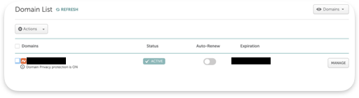
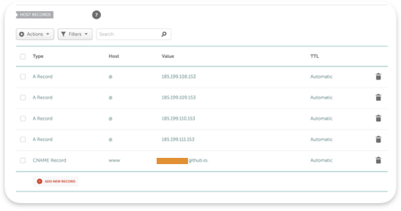
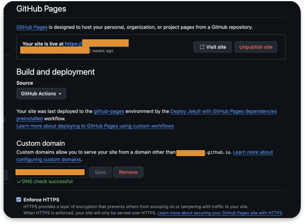

# Basic DNS Setup
This is a project from roadmap.sh called *Basic DNS Setup*. The goal is to learn how to configure a domain and use it for a static web site.

## Purchasing a domain
For this project, I bought a domain from [Namecheap](https://namecheap.com). Avoid using expensive domain names for this project, unless you intend to keep it for your future endeavours.

## Managing DNS
Once your domain has been purchased, you can modifiy the DNS records.

The following steps are performed on the Namecheap platform. Click manage on your domain to access its properties.



## GitHub Pages
For GitHub, the process is pretty straightforward. However, note that GitHub does not provide name servers. It provides IP blocks.

Therefore, make sure your DNS is set to Namecheap Basic DNS.

Go in the *Advanced DNS* tab and add the followiing IPs as A records in the Host section.

```
185.199.108.153
185.199.109.153
185.199.110.153
185.199.111.153
```

[Source](https://docs.github.com/fr/pages/configuring-a-custom-domain-for-your-github-pages-site/managing-a-custom-domain-for-your-github-pages-site)

The @ is the apex domain (i.e your domain name) as required by GitHub

Also add a CNAME record with your GitHub username before the `.github.io` string.

Be aware that it might take a couple hours before DNS propagation is done. In my case, it took 15-20 minutes for everything to work.



Add the domain to the Pages settings (in your repo) and check the `Enforce HTTPS` box.



You can use the dig command to see if the changes have been applied:
```
# Domain A records
dig example.com

# CNAME record
dig www.example.com
```


You are all set and done.

## Digital Ocean