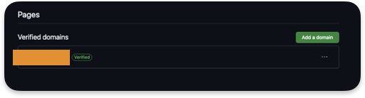
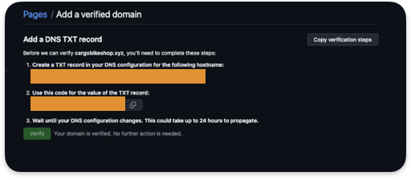
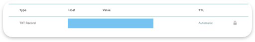
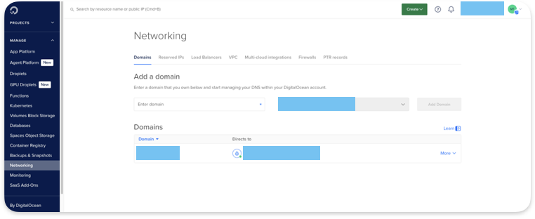
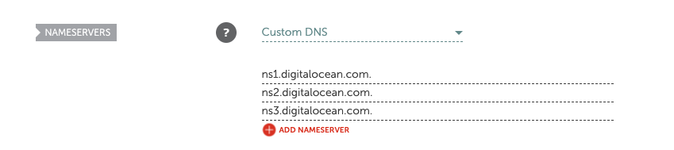
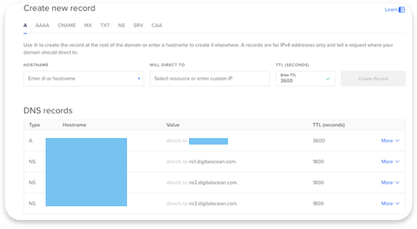
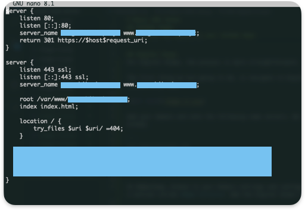

# Basic DNS Setup
This is a project from roadmap.sh called *Basic DNS Setup*. The goal is to learn how to configure a domain and use it for a static web site. The project is from [roadmap.sh](https://roadmap.sh/projects/basic-dns).

## Purchasing a domain
For this project, I bought a domain from [Namecheap](https://namecheap.com). Avoid using expensive domain names for this project, unless you intend to keep it for your future endeavours.

## Managing DNS
Once your domain has been purchased, you can modifiy the DNS records.

The following steps are performed on the Namecheap platform. Click manage on your domain to access its properties.


## GitHub Pages
### DNS set up
Note that GitHub does not provide name servers. It provides IP addresses.

Therefore, make sure your DNS is set to Namecheap Basic DNS.

Go in the *Advanced DNS* tab and add the followiing IPs as A records in the Host section.

```
185.199.108.153
185.199.109.153
185.199.110.153
185.199.111.153
```

[Source](https://docs.github.com/fr/pages/configuring-a-custom-domain-for-your-github-pages-site/managing-a-custom-domain-for-your-github-pages-site)

The @ is the apex domain (i.e your domain name) as required by GitHub

Also add a CNAME record with your GitHub username before the `.github.io` string.


Be aware that it might take a couple hours before DNS propagation is done. In my case, it took 15-20 minutes for everything to work.

### Domain Verification
This step is optionnal but allows you to protect your domain from being used by another GitHub user.

Go to your personnal profile settings in the Pages section and add a new to domain to verify.



You will need to go back to your domain provider and add a TXT record.

In our case, the TXT record is some sort of challenge to prove you own your domain.



For Namecheap, you can add a TXT record in the Advanced DNS Mail Settings section.

The host is the value in the first box provided in the screenshot above (do not add your domain). The value is the second box.



### Adding the domain to your GitHub Repo
Add the domain to the Pages settings (in your repo) and check the `Enforce HTTPS` box.


You can use the dig command to see if the changes have been applied:
```
# Domain A records
dig example.com

# CNAME record
dig www.example.com
```

You are all set and done.

## Digital Ocean
For Digital Ocean, the process is different and needs more technical skills.

### Modifying the DNS records

The first thing we are going to do, is navigate to Digital Ocean, log in and access the *Networking* tab.



Add your domain and note the following name servers. We will not specify IP addresses like GitHub.

```
ns1.digitalocean.com
ns2.digitalocean.com
ns3.digitalocean.com
```

On Namecheap, browse to your Domain settings and configure DNS to Custom DNS. You will see a section called *Name Servers*. Add the Digital Ocean name servers.



Now, just make sure your DNS records look like this on Digital Ocean :



The hostname should be your domain and the A record should direct to your droplet IP.

Again, the changes need a couple minutes or hours before you can ping or nslookup your domain and retrieve the correct information.

### Site Templates

Now, navigate to your server nginx directory `/etc/nginx`

Your site files (`./sites-available` and `./sites-enabled`) should look like this : 



In my case, I do not allow connections using HTTP. I have a [Let's Encrypt](https://letsencrypt.org/getting-started/) certificate that allows my site to use HTTPS. Therefore, HTTP requests will be redirected to HTTPS. Further reading and instructions can be found here : [Certbot Instructions](https://certbot.eff.org/instructions?ws=nginx&os=snap)

### NGINX Config File
Edit the `/etc/nginx/nginx.conf` file and add your domain to it :

```
	server {
		listen 80;
		listen [::]:80;
		server_name [YOUR DOMAIN] www.[YOUR DOMAIN];

		return 301 https://$host$request_uri;
	}

```

Your website hosted on your Droplet should now be available from the Internet when you type its name.